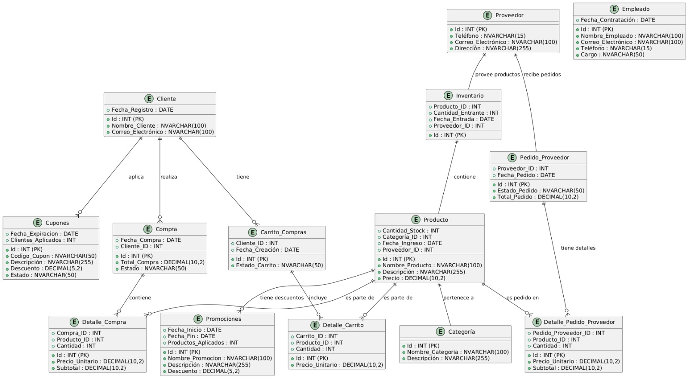

# Proyecto Final - LIBRERIA

## BACKEND
El Backend seguira la arquitectura de "n-layered" y se dividira en las siguientes capas:
- **Presentation Layer**: Se encargara de recibir las peticiones del cliente y tener la comunicacion con la capa de negocio.
- **Business Logic Layer**: Se encargara de gestionar las reglas de negocio.
- **Data Access Layer**: Se encargara de gestionar la persistencia de los datos.

El uso de la plataforma de .net usando csharp y .net core 8

## FRONTEND
El Frontend seguira la arquitectura "mvc" y se dividira en las siguientes capas:
- **Model**: Se encargara de gestionar los datos.
- **View**: Se encargara de la presentacion de los datos.
- **Controller**: Se encargara de gestionar las peticiones del cliente y tener la comunicacion con la capa de negocio.

Se usara Angular Material como libreria de estilos y Angular 18 como framework de desarrollo.

## BASE DE DATOS
Nuestra base de datos por defecto sera "SQL Server" y se usara "Entity Framework" como ORM.
Ademas para el uso de SQL Server se usara una imagen de "Docker" para la base de datos.

